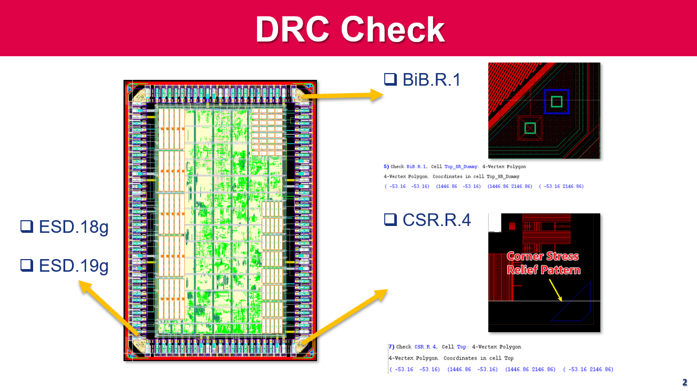
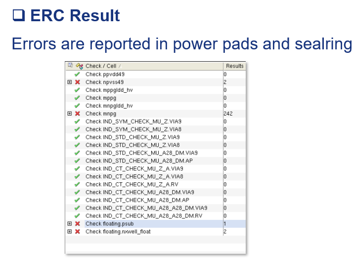
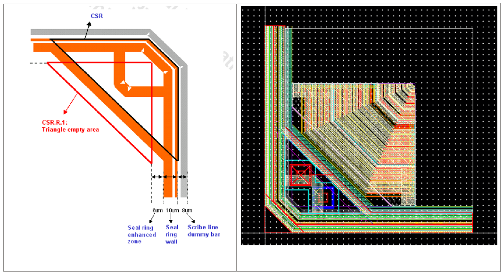
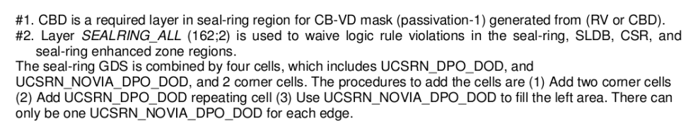
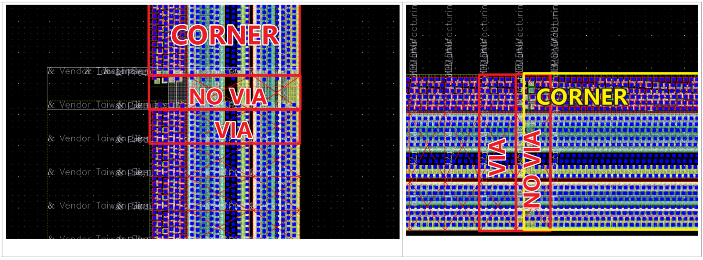
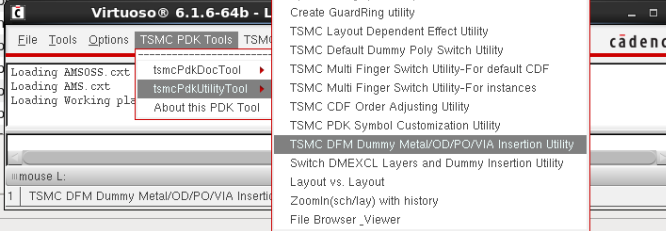
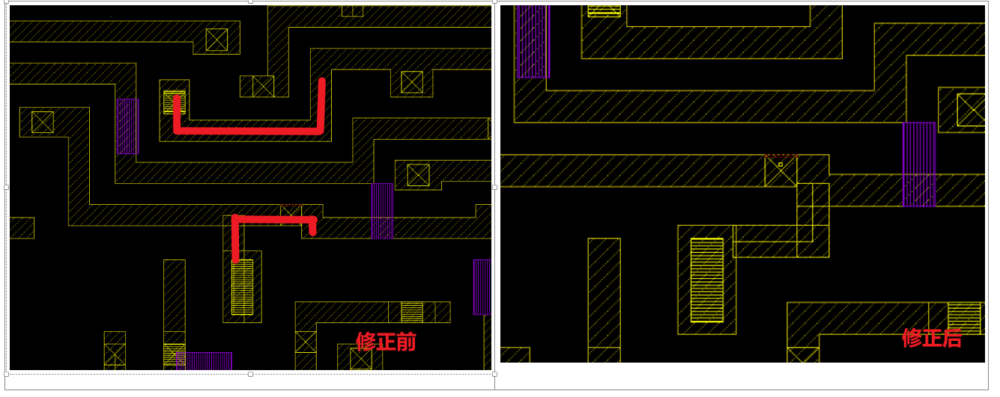

# T28 DRC-LVS-Dummy-SealRing

### 1. DRC

DRC需要检查DRC ANT assumuble rules，提交时需要同时提交DRC Clear的log

#### 1.1. **DRC  Manual路径**

​`Path@VLSI-04:/materials/technology/tsmc28/28HPC+RF/DRM_and_Sealring/tn28cldr002_2_1/TN28CLDR002_2_1.pdf`​

‍

#### 1.2 DRC时，如果是Cell级设计，需要关掉以下Option，整片设计则需要打开

```//#DEFINE
//#DEFINE FULL_CHIP                       // Turn on for chip level design

//#DEFINE WITH_SEALRING                   // Turn on if Seal-Ring is already added in chip layout
```

DRC文件参考：`Path@04: /workspace/home/guanyj/TSMC28_Rules/DRC`​，里面也有runset可以直接调用 `Path@04: /workspace/home/guanyj/TSMC28_Rules/T28_DRC.runset`​

🔴**Warning：注意流片时，calibre.drc, ANT, WIRE_BOND都需要跑**

‍

#### 1.3 DRC Waive

ESD，Latchup，LUP，IO的DRC可以Waive

IO中可能会出现的DRC如下，经过确认后可以Waive：

​

ERC中若报出的Error均在Power Pads或Sealring中，可以Waive掉：

​​

#### 1.3. SPICE模型的文档在：

​`Path@04: /materials/technology/tsmc28/28HPC+RF/PDK/TSMC_iPDK/tn28crsp029w1_1_8_2p2a/iPDK_CRN28HPC+ULL_v1.8_2p2a_20190531_all/PDK_doc/TSMC_DOC_WM/model/1d8`​

‍

### 2. LVS

LVS文件参考：`Path@04: /workspace/home/guanyj/TSMC28_Rules/LVS`​，里面也有runset可以直接调用 `Path@04: /workspace/home/guanyj/TSMC28_Rules/T28_LVS.runset`

​

#### 2.1 LVS时报XgCGor的找不到

可以直接去cdl里把对应的给注释掉，这些模块都是空的

‍

#### 2.2. LVS要注意需要手动加电源的Pin Text，如VDD1,VDDPST,VDD2等

🔴**Warning：**LVS要注意需要手动加电源的Pin Text，如VDD1,VDDPST,VDD2等，否则LVS会找不到对应的Power Net，Text加的层与标准单元里Pin脚上的Label类似

‍

### 3. **Seal Ring**

根据DRC Manual中，Section 4.5.65，四边需要留出24um给SealRing，选用MR版本GDS，CORNER应刚好卡在REF层边缘（红色虚线）

🔴**Warning：**强烈建议放Seal Ring前先读一遍 DRC Manual中，Section 4中关于Seal Ring的部分，知其然知其所以然

Sealring的 gds文件在：`Path@04:/materials/technology/tsmc28/28HPC+RF/DRM_and_Sealring/tn28cldr002_2_1/N28_TSMC_SRDMB_Mr_1P10M_002_20160711_SR_BKM.gds`​，直接在Virtuoso中导入即可

‍

#### 3.1 Seal Ring的角怎么加

Virtuoso中为CSR1DMY

​​

​​

#### 3.2 **Seal Ring的边怎么加？**

USCRN和UCSRN_NOVIA怎么加？UCSRN_NOVIA有VIA那一侧要对齐USCRN阵列，为了避免Via重叠的DRC；USCRN_NOVIA即使完全和Corner重叠也可以，前提是别用有Via的那一边对着Corner，prBoundry层和SEALRING dr2层要对齐

​​

‍

### 3. 怎么加Dummy

#### 3.1 **使用脚本加Dummy（推荐使用）**

**生成Dummy：**

修改脚本中的gds路径和Top Cell名，脚本路径如下：

​`Path@VLSI-04:/workspace/home/guanyj/iPDK_CRN28HPC+ULL_v1.8_2p2a_20190531/Calibre/dummy_util/Dummy_OD_PO_Calibre_28nm_HP_19b/Dummy_OD_PO_Calibre_28nm_HP.19b`​

`Path@VLSI-04:/workspace/home/guanyj/iPDK_CRN28HPC+ULL_v1.8_2p2a_20190531/Calibre/dummy_util/Dummy_OD_PO_Calibre_28nm_HP_19b/Dummy_Metal_Via_Calibre_28nm.20a`​

‍

生成Dummy的GDS，包含 OD PO层的Dummy与Metal Via层 Dummy，一共2个GDS：

```
calibre -drc -hier -turbo Dummy_OD_PO_Calibre_28nm_HP.19b

calibre -drc -hier -turbo  Dummy_Metal_Via_Calibre_28nm.20a
```

‍

**Merge GDS：**

a.在csh终端敲入 calibredrv -shell

b.输入layout filemerge -in DODPO.gds -in DM.gds -in /workspace/home/guanyj/SSCNN/layout/Top_SR.gds -out Top_SR_Dummy.gds -createtop Top_SR_Dummy

‍

#### 3.2 用TSMC Utility加Dummy (不建议用，会出错)

​​

点一下File可以激活TSMC PDK Tools，选Insertion Utility后，到/iPDK_CRN28HPC+ULL_v1.8_2p2a_20190531/skill/Dummy_insertion_utility/Calibre/Dummy_Metal_Via_Calibre_28nm_V20a/Dummy_Metal_Via_Calibre_28nm.20a中根据1P10M5X2Y2R打开需要dummy的层（每次启动Utility选项都会重置！现在每次刷新都配置好了是1P10M）

‍

‍

### 12. Calibre DRC检查出现CIC(EFP.M2.S1) in FA1D0BWP7T30P140UHVT

手动连线，采用如下方案修复

​​

‍

2022.6.2      Meeting

‍

1. ‍
2. ‍
