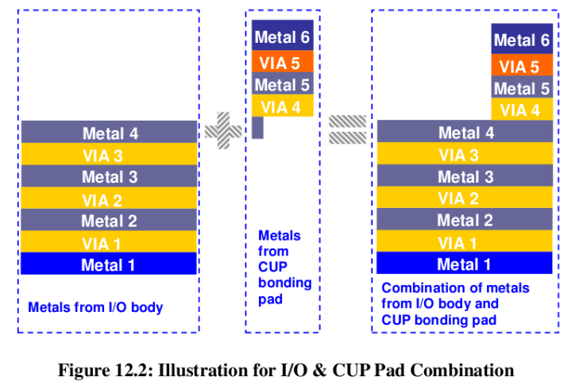
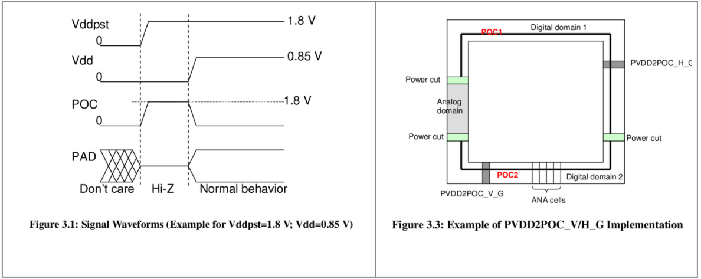
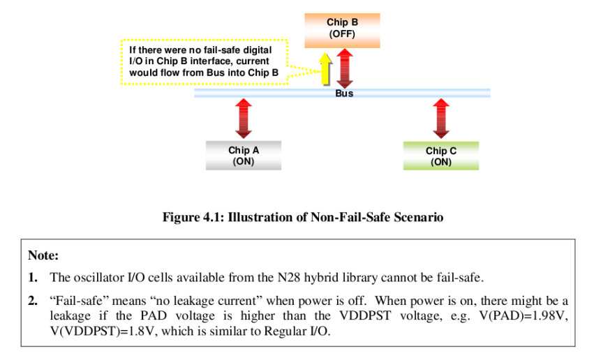
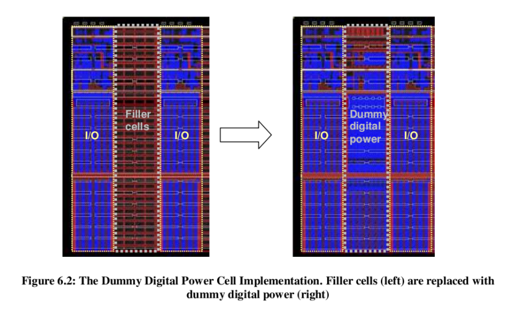
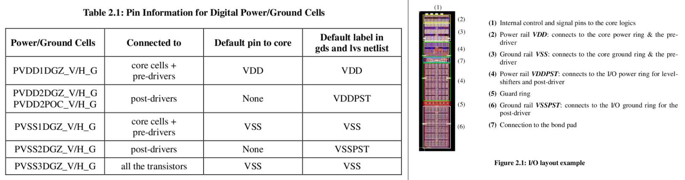
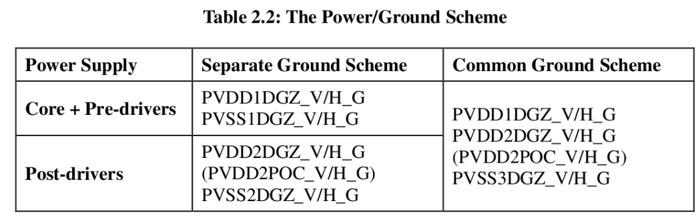
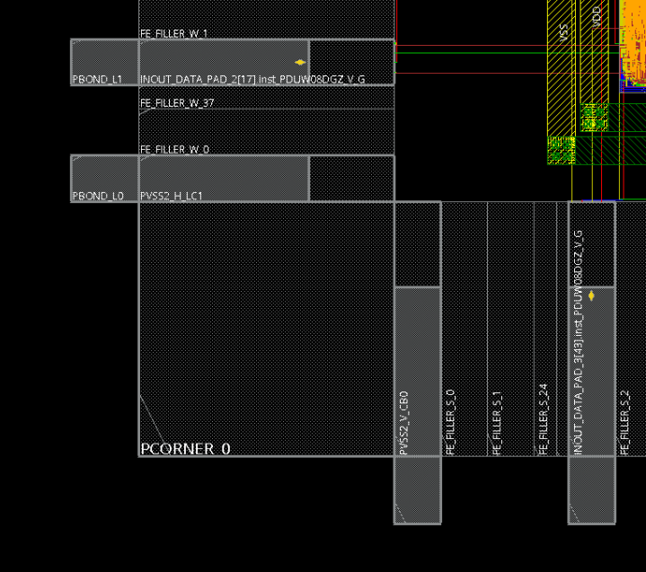
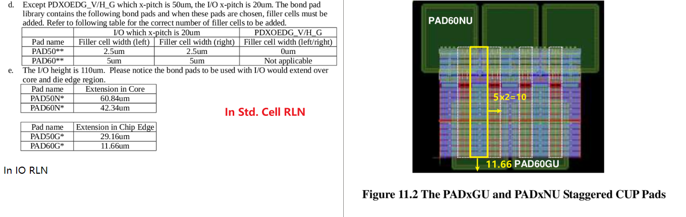
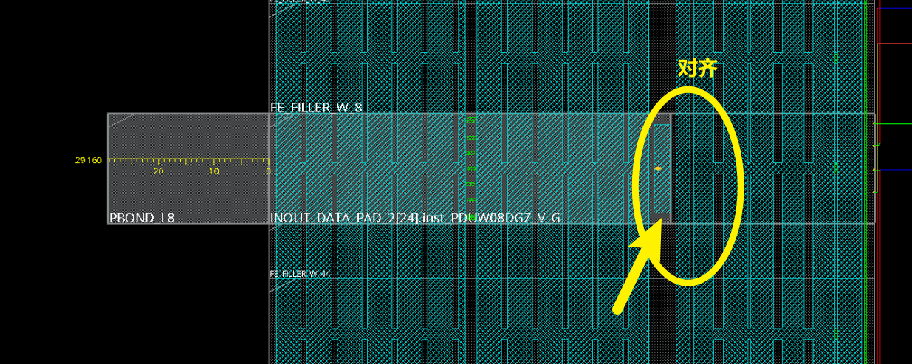

# T28 IO Note

**Author:** Yujiang Guan 	**Created Date:** 2022-5-19

|Version|Author|Modified|Contents|
| ---------| ---------| ------------| ----------------------------|
|1.0|YJ-Guan|2022-05-19|First Version|
|1.1|YJ-Guan|2023-06-12|Markdown Version, Uploaded|

🔴**Warning：It's strongly recommended to read the Std I/O Application Note completely first !!!!! 	本文档仅供快速查阅，若想完整理清T28 IO规则请阅读AppNote，路径为：****`Path@04: /materials/technology/tsmc28_tar/28nm_IO_Application_Note_P&R_Constraint_File/an_n28_general_io_applicationnote_v1d4.pdf`**​

‍

### 1. CUP (Circuit Under Pad)

​​

**CUP stands for Circuit under Pad**, which means, the bond pad is placed on top of the I/O cell, commonly known as the CUP wire-bond application.

The CUP pad pin of the staggered I/O is located close to the center of the I/O cell. To connect the CUP pad to the I/O cell, it is required to instance the I/O and the corresponding bond pad at the same coordinates

‍

### 2. Power On Control (POC)

​

‍

🔴**Warning：每个数字IO域中至少都要有一个 且只有一个Bonded 的 PVDD2POC_V/H_G Cell！**

1. The Power-On-Control is to avoid I/O crowbar current or bus contention when the I/O voltage is up before the core voltage.
2. It is **mandatory to use ONE-and-Only-One PVDD2POC_V/H_G in each digital domain** that contains digital function I/O  cell. Implementation of POC cell can be achieved by replacing one PVDD2DGZ_V/H_G with one PVDD2POC_V/H_G in each digital I/O domain.

    The PVDD2POC_V/H_G cell can be either bonded out (as a POC signal generator and the post-driver power supply), or not (as a POC signal generator only).

3. When there is no digital function I/O cell in the I/O domain, it is not required to implement the PVDD2POC_V/H_G cell.      To prevent POC rail from floating, it is required to tie the POC rail to ground.

4. **POC LVS: It is necessary to put a label (for example: POC1) on the top level of POC rail. ​**The number of added label texts should be the same as the number of PVDD2POC_V/H_G cell implemented on the chip.

‍

### 3. Fail Safe

​

​The design of TSMC fail-safe digital I/O is in particular for the fail-safe application that requires I/O pad to**​ sustain voltage without current flowing from bus to the chip,** when both VDDPST (IO /post-driver power) and VDD (core / pre-driver power) are off.

‍

### 4. IO Filler

​​

1. It is required to  insert the wide fillers first and then the narrow fillers afterwards. To avoid the  metal-slot-rule violation, do not only use narrow filler cells to fill the      large I/O space.
2. For ESD robustness, if the empty   space is longer than one digital I/O cell width, we strongly recommend to**​ implement the dummy digital core power cell (PVDD1DGZ_V/H_G) or the dummy digital I/O power cell (PVDD2DGZ_V/H_G)** together with the filler cells to fill the gap, where dummy means not-bonded, but used as filler cell.

🔴**Warning：可以使用不Bonded的Power VDD1/VDD2 IO充当IO，减少ESD**

Filler加IO的方法为直接调用指令：

```tcl
addIoFiller -cell {PFILLER0005_G PFILLER05_G PFILLER1_G PFILLER5_G PFILLER10_G PFILLER20_G} -side bottom 
addIoFiller -cell {PFILLER0005_G PFILLER05_G PFILLER1_G PFILLER5_G PFILLER10_G PFILLER20_G} -side left 
addIoFiller -cell {PFILLER0005_G PFILLER05_G PFILLER1_G PFILLER5_G PFILLER10_G PFILLER20_G} -side top 
addIoFiller -cell {PFILLER0005_G PFILLER05_G PFILLER1_G PFILLER5_G PFILLER10_G PFILLER20_G} -side right
```

‍

### 5. Digital I/O Power/Ground Rail

​​

​​

电源Pad有两种方案，Separate Ground和Common Ground，即VSS和VSSPST是否共用。

通常一个数字芯片无特殊需求的话，有四个电源端口VDD/VSS，VDDPST/VSSPST

这里的VDD/VSS为供给IO Pad的低电压或芯片内部Core电源网络的电压，标准电压为0.9 V。VDDPST/VSSPST为给IO Pad的高电压，为1.8 V。外部信号输入给芯片为1.8 V，信号Pad（PDUW08DGZ_V/H）中有Level Shifter，将其转换为0.9 V的信号输出给Core，内部信号输出给外部时同理。

**The separate ground scheme ​**separates (the core & the pre-drivers) VSS ground from (the post-driver) VSSPST for noise consideration.

**The common ground scheme** provides only one VSS ground source to all transistors.PVSS3DGZ_V/H_G is the digital ground cell that supplies the core, pre-drivers, and post-drivers.

Separate GND用的Pad多，Noise小。

Common GND用的Pad少，因为共地Noise大，但是同样因为共地，GND多，ESD较好。

**通常我们用Separate GND的方案**，即一组IO电源为4个Pad，PVDD1DGZ_V/H_G（用来提供VDD），PVSS1DGZ_V/H_G（用来提供VSS），PVDD2DGZ_V/H_G（用来提供VDDPST），PVSS2DGZ_V/H_G（用来提供VSSPST）

‍

### 6. Corner （PCORNER_G）

It is required to implement the **bonded digital I/O ground cell (PVSS2DGZ_V/H_G, PVSS3DGZ_V/H_G) right next to each side of the corner cell** for ESD consideration.

🔴**Warning：Corner Cell左右两侧均需要放置一个Bonded的PVSS2DGZ_V/H_G，如下图所示**

​​

‍

### 7. Power-Cut Cell (PRCUT_G)

🔴**Warning：若要将IO分为两个数字IO域，则需要在中间插入Cut Cell，注意Cut Cell左右两侧要放置 PVSS1DGZ_V/H_G，如果是分隔数字和模拟IO还需要再查阅AppNote**

1. Used to  seperate two digital voltage domain IO. The power (VDD, VDDPST), POC rail,  and the ground (VSSPST) bus are open within the PRCUT_G cell, while only      the VSS bus (i.e. global ESD bus) stays connected through the power-cut cell.
2. For the robust cross-domain ESD & latch-up protection, it is required to **implement the digital ground  (PVSS1DGZ_V/H_G / PVSS3DGZ_V/H_G) right next to the power-cut cell. ​**Doing so can shorten the ESD discharge path across domains.

‍

### 8. Simultaneously Switching Output (SSO) 计算需要的供电IO数

1. SSN Effect：多个IO同时同方向翻转，因更多电流流过 pad ring，在PG IO 的 bonding wire 及片外引线上的电感上，产生 Ldi/dt 的压降。也即SSN，同时切换噪声，主要是会引起地弹（Ground-bonuced noise effect）
2. Driving  Index(DI): 在只使用1个ground cell的时候，多少个IO从1到0翻转不会使输出的0产生的噪声超过noise margin (不适用1时候的噪声是因为0的噪声容限低)
3. Driving Factor (DF): $DF=1/DI$
4.

🔴**Warning：根据计算按大概7个左右的信号Pad就需要一组电源Pad。但实际情况没有空间放这么多的电源Pad，有空间就放电源Pad，越多越好，大概10-15个信号Pad放一组比较合理**

**降低SSO的方法：**

1. 增加供给pad 用的电源IO 数量；
2. 采用double bonding 或triple bonding；
3. 采用 slew rate control 的 IO；
4. 避免把 pad 电源 IO 放在 corner 上（corner 处 bonding wire 引线最长，L 最大）

‍

### 9. ESD/Latch-Up Requirement

|PVDD2DGZ_V/H_G|>2|PVDD1DGZ_V/H_G|>3|
| ------------------| ----| ------------------| ------|
|PVDD2POC_V/H_G|=1|PVSS1/3DGZ_V/H_G|>1|
|PVSS2/3DGZ_V/H_G|>1|PVDD1ANA_V/H_G|>3|
|PVDD2ANA_V/H_G|>2|PVSS1/2ANA_V/H_G|=VDD|

1. At least one PCLAMPC_V/H_G together with  PVDD1ANA_V/H_G analog power and PVSS1ANA_V/H_G analog ground pair.

2. At least one PCLAMP_G together with PVDD2ANA_V/H_G analog power and PVSS2ANA_V/H_G analog ground pair.

‍

### 10. Bond Pad

> It is required to insert the appropriate number of filler cell if the target pad pitch is bigger than the I/O pitch. It should also be noted that, depending on the pitch,      the CUP bonding pad could extend over the I/O edge (towards chip edge) as well as the   core region, therefore blocking some metal layers for place and  route, it is necessary to first place the CUP bonding pads prior to  P&R.

​​

Bond Pad用于将信号Pad的信号从下层金属引出到顶层金属，可以理解为开一个天窗，则每一个需要输出到芯片外部，或者从外部输入的信号/电源Pad都需要加上Bond Pad

具体的摆放规则请看IO的Release Note，我们使用的Bond Pad为**PAD50NU**（Inner）与**PAD50GU**（Outter）

>  注：UMC 55nm的工艺不需要Bond Pad，信号Pad IUMBFS直接就可以穿到顶层金属

* 如果IO Pad数量不多，可以仅使用Outer的Bond Pad，即PAD50GU，参照上表，Outter Bond Pad需要伸出芯片边缘$29.16 \ \mu m$，达到如下效果：

​

如果只用Outter，根据上表，相当于中间Inner Pad的位置空出，Pad的宽度为$20 um，$那么IO之间需要插入**的Filler，如下图所示：

​

Floorplan的脚本可参考：`Path@04:/workspace/home/guanyj/SSCNN/APR/script/floorplan.tcl`​

加Bond Pad通写坐标实现，脚本可参考：`Path@04:/workspace/home/guanyj/SSCNN/APR/script/add_bond.tcl`​

* 如果是Staggered Pad，Filler为$2.5um$(注意这个Filler指的是每个IO左右都要有，那么两个IO之间就需要2个Filler的距离)，即每个IO Pad之间至少需要隔开$5um$

Floorplan和Bond Pad脚本可参考：`Path@04：/workspace/home/songxj/PointAcc/APR/script`​

‍
