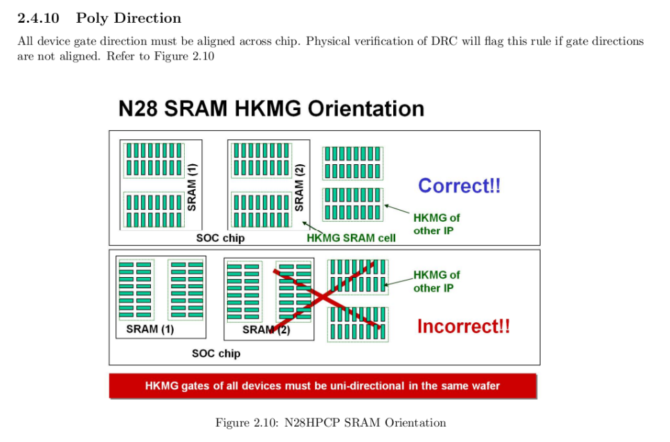
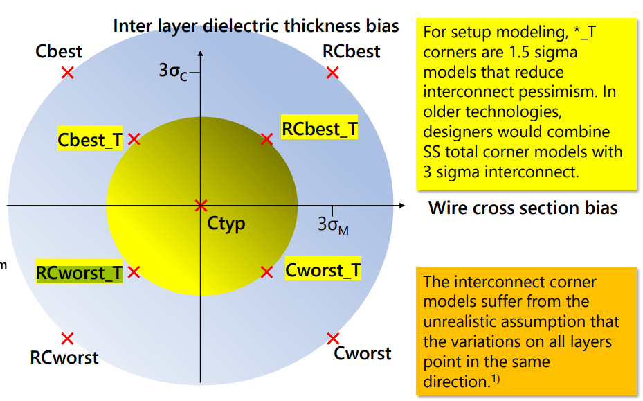
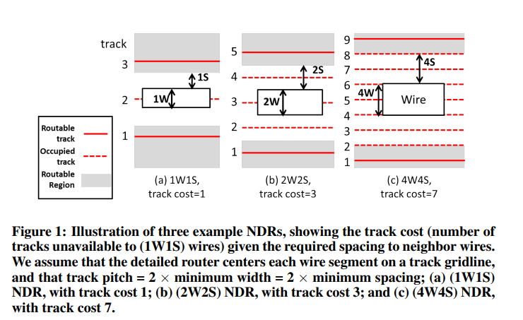
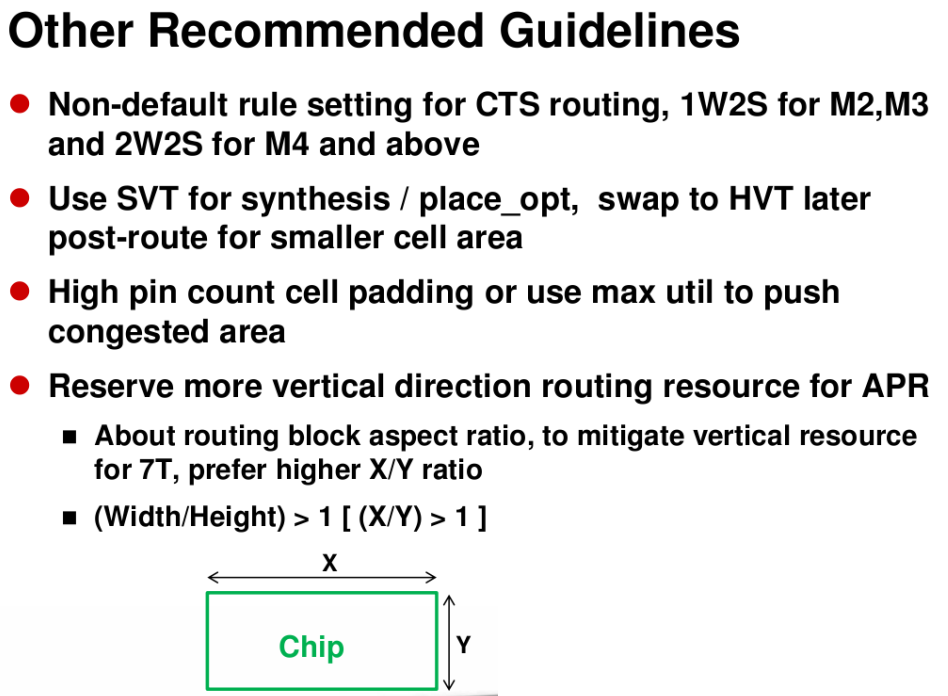
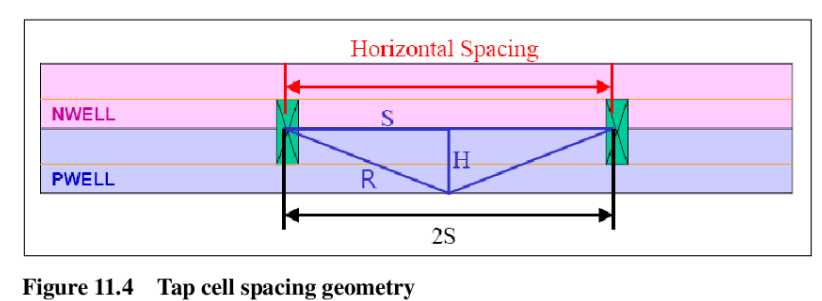
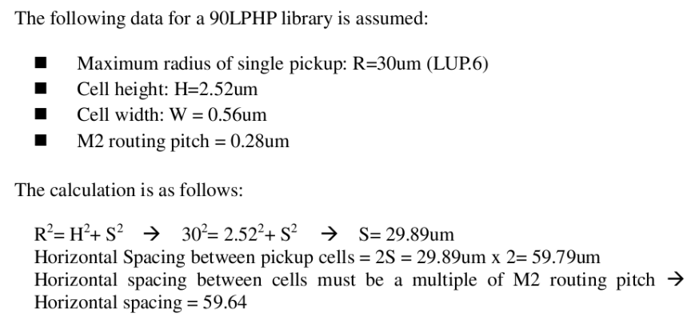
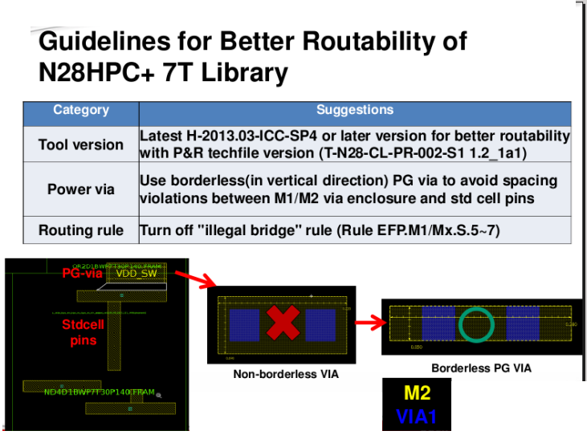
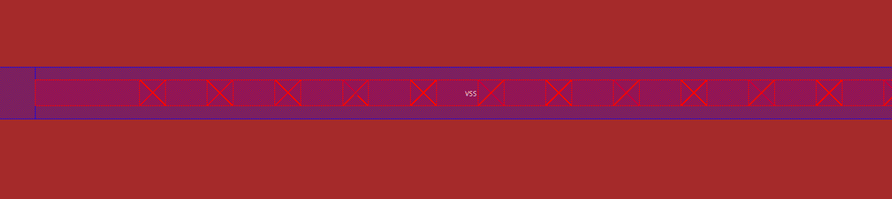
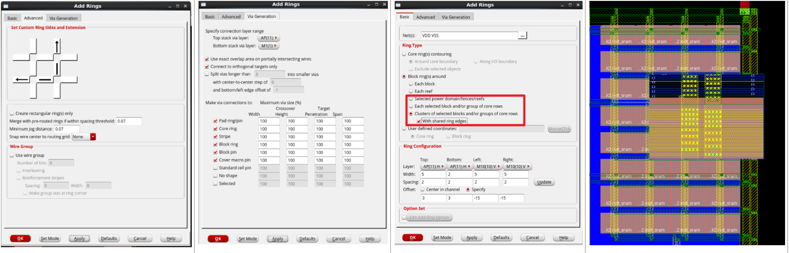

# T28 后端常见问题

**Author:** Yujiang Guan 	**Created Date:** 2022-06-29

|Version|Author|Modified|Contents|
| ---------| ---------| ------------| ----------------------------|
|1.0|YJ-Guan|2022-06-29|First Version|
|1.1|YJ-Guan|2023-06-06|Markdown Version, Uploaded|

‍

### 1. **Metal Option为1p10_5X2Y2R**

45nm，特征尺寸

1P10M, 1 poly 10 metal

X Y Z U 都指的是厚度，比如说X是2倍M1厚度，Y是4倍M1厚度

6X1Y1Z1U 指的是M2-M7是X的厚度，M8是Y的厚度，M9是Z的厚度，M10是U的厚度

🔴**Warning：调用的文件一定要注意Metal Option是否正确，包括DRC LVS文件中的Metal Option选项**

‍

### 2. **HVH/VHV → Routing Tracks方向**

这里我们使用HVH的版本，在APR文件夹的 techFile中有生成好的版本，

`Path@VLSI-04:`

​`/workspace/home/guanyj/SSCNN/APR/techFile/tsmcn28_10lm5X2Y2RUTRDL.tlef`​

##### 2.1 **.tlef file用于定义Site/Track，Innovus DRC Check, Innovus怎么读入.tlef?**

tlef即tech lef

🔴**Warning：**在Innovus中注意 **tlef要先于其他lef读取，**否则会报错

/workspace/technology/tsmc28/28HPC+RF/APR_Tech/Cadence/tn28clpr002e1_1_9_1a/PRTF_EDI_28nm_Cad_V19_1a/PR_tech

‍

##### 2.2 **需要自己生成.tlef? ​**

可参考：[**https://blog.csdn.net/graymount/article/details/120806691**](https://blog.csdn.net/graymount/article/details/120806691)

注意设置**7 Track**，同时Std Cell里写到**​ Poly Pinch=140**，参考/workspace/home/guanyj/SSCNN/APR/techFile/readme

已经生成好的在这里

​`Path@VLSI-04:`

`/workspace/home/guanyj/SSCNN/APR/techFile/tsmcn28_10lm5X2Y2RUTRDL.tlef ​`​

如果需要（或者想体验）自己生成.tlef的流程，可参考如下指令(`Path@VLSI-04:`​)：

 `/workspace/technology/tsmc28/28HPC+RF/APR_Tech/Cadence/tn28clpr002e1_1_9_1a/PRTF_EDI_28nm_Cad_V19_1a/GenPRTF.tcl ​`​

​`tclsh GenPRTF.tcl -InputPRTF PR_tech/Cadence/LefHeader/HVH/tsmcn28_10lm5X2Y2RUTRDL.tlef -CellHeight 7 -VRP 0.14`​

### 4. **SRAM方向必须和Std方向保持一致，R0即为版图中的方向**

下图来自：

> /workspace/technology/tsmc28/TSMC_28_IP/SRAM_Macros/tsn28hpcpl2spsrammacros_180a/tsn28hpcpl2spsrammacros_180a_doc/sram/Documentation/documents/tsn28hpcpl2spsrammacros_180a/DB_TSN28HPCPL2SPSRAMMACROS_180A.pdf

注意Innovus中R0的方向即与Virtuoso版图中方向一致

🔴**Warning：所有SRAM必须在Innovus中以R0方向摆放**

​​

‍

### 5. **RCWORST_T**

​

​

### 6. **CTS Non Default Rule**

​​

​​​​​

‍

### 7. **WELLTAP摆放距离**

​​

​

根据std cell app note，7T cell height = 0.7， DRC Rule中LUP.6=33

计算得到S=32.992um，2S=65.985，M2 Route Pitch = 0.1(in .tlef file)，**所以WELLTAP最小间隔取60um**

🔴**Warning：为满足DRC要求，WELLTAP最小间隔取60um（采用棋盘法摆放WELLTAP）**

‍

### 9. **Stripe到Followpin之间的Via需要手动替换**

/materials/technology/tsmc28/TSMC_28_IP/STD_CELL/tcbn28hpcplusbwp7t30p140_190a/tcbn28hpcplusbwp7t30p140_190a_rln/digital/Documentation/release_note/GL_TCBN28HPCPLUSBWP7T30P140_190A.pdf

​​

/workspace/home/guanyj/SSCNN/APR/script/change_via.tcl

V12的通孔需要为Borderless类型的，如下图所示

​​

具体方法可以使用GUI中的 Edit-Wire-Add Via 生成一个需要替换的通孔，放置以后删除掉，会保存一个VIAGEN开头的临时通孔类型，然后进行替换

更推荐使用类似的指令

```tcl
uiSetTool addVia
setViaEdit -cut_layer VIA1

setViaEdit -x_size 0.05
setViaEdit -y_size 0.05
setViaEdit -cols 36
setViaEdit -y_space 0
setViaEdit -x_space 0.08
setViaEdit -x_botenc 0.2
setViaEdit -y_botenc 0.025
setViaEdit -x_topenc 0.2
setViaEdit -y_topenc 0
```

生成一个通孔类型，之后对通孔进行替换

```tcl
editSelect -wires_only 0 -shape FOLLOWPIN

editChangeVia -from VIAGEN12_4 -to EDI_V12_36x1 -selected
```

‍

### 10. **注意T28的SRAM自身不带Power Ring，需要给他打电源**

可以直接用GUI-Add Ring，把offset调成负的，在Set Custom Ring中调整需要的边数，延伸到Power Ring上

​​​​

‍

### 11. T28的设计不允许使用FILLER1

🔴**Warning：由于OD-Spacing Effect不能使用Filler1，在Place阶段设置约束使两个Cell至少保持2个Site的Gap**

可在Placement前使用如下指令：

​`setPlaceMode -fillerGapEffort high -fillerGapMinGap 0.28`​
