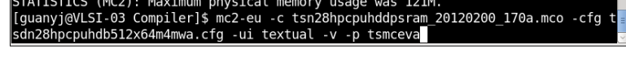

# T28 Memory Complier Note

**Author:** Yujiang Guan 	**Created Date:** 2022-10-18

|Version|Author|Modified|Contents|
| ---------| ---------| ------------| ----------------------------|
|1.0|YJ-Guan|2022-10-18|First Version|
|1.1|YJ-Guan|2023-06-06|Markdown Version, Uploaded|

### TSMC 28 Memory Compiler

1. 复制整个Memory Compiler文件夹(VLSI-03:/workspace/home/guanyj/Memory_complier)，怎么使用可以参照文件夹中PPT
2. 开个terminal
3. ​`csh`​
4. ​`source   ~/Memory_complier/TSMC_MC/cshrc.mc2`​
5. ​`cd $MC2_INSTALL_DIR/aux/flexlm/amd64_re3`​
6. ​`lmgrd -c ~/Memory_complier/TSMC_MC/license/license_20220407_vlsi03.dat`​
7. 选择你要生成的SRAM类型，进入文件夹，比如`cd ~/Memory_complier/SRAM/SRAM/ROM/Complier`​中
8. 直接执行`./tsn28hpcprom_130a.pl`​类似的.pl的文件，添加-h可以看见，如添加-NonSLP    -NonBIST -NonSD等选项
9. 即会生成config.txt中写明的Memory类型，具体型号参照TSMCHOME Doc和Datasheet
10. UHD的SRAM.pl文件无法直接Compile出SRAM文件，可以直接调用如下命令，需要.mco文件和.pl文件生成的.cfg文件

​​
