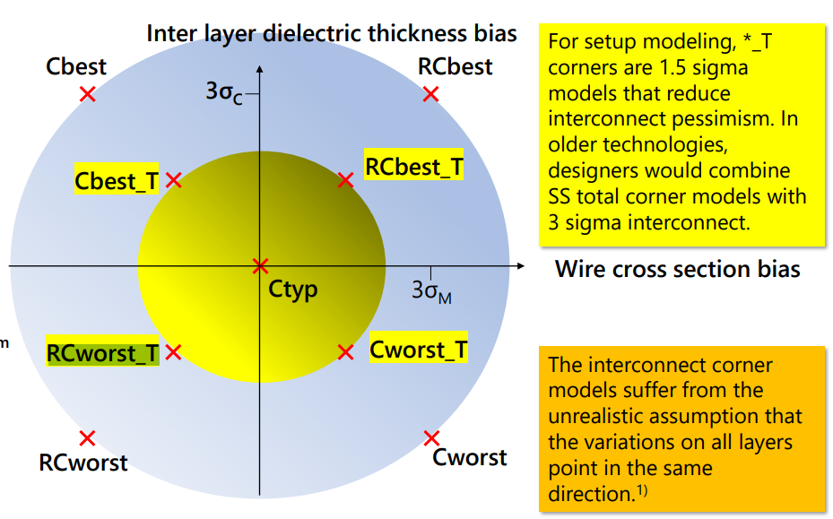
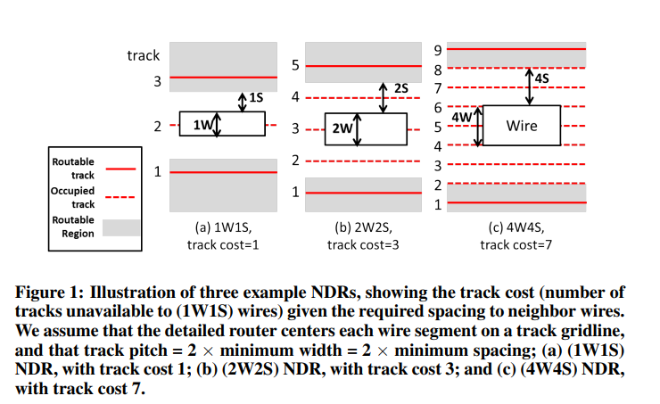
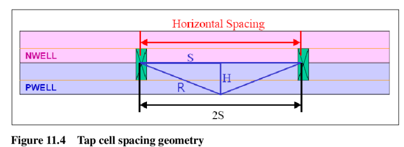
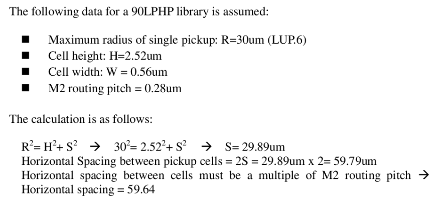
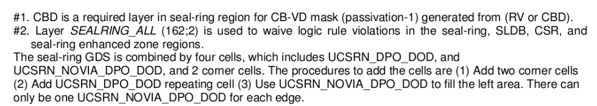

# TSMC 28 后端常见问题

* **1p10_5X2Y2R**

  45nm，特征尺寸

  1P10M, 1 poly 10 metal

  X Y Z U 都指的是厚度，比如说X是2倍M1厚度，Y是4倍M1厚度

  6X1Y1Z1U 指的是M2-M7是X的厚度，M8是Y的厚度，M9是Z的厚度，M10是U的厚
* **HVH/VHV → Routing Tracks方向**

横着摆Std Cell就应该用

* **.tlef file用于定义Site/Track，Innovus DRC Check, Innovus怎么读入.tlef?**

注意tlef要先于其他lef读取

/workspace/technology/tsmc28/28HPC+RF/APR_Tech/Cadence/tn28clpr002e1_1_9_1a/PRTF_EDI_28nm_Cad_V19_1a/PR_tech

* **需要自己生成.tlef? ​**
* [**https://blog.csdn.net/graymount/article/details/120806691**](https://blog.csdn.net/graymount/article/details/120806691)

注意设置7Track，同时Std Cell里写到 Poly Pinch=140，参考/workspace/home/guanyj/SSCNN/APR/techFile/readme

已经生成好的在这里/workspace/home/guanyj/SSCNN/APR/techFile/tsmcn28_10lm5X2Y2RUTRDL.tlef

/workspace/technology/tsmc28/28HPC+RF/APR_Tech/Cadence/tn28clpr002e1_1_9_1a/PRTF_EDI_28nm_Cad_V19_1a/GenPRTF.tcl

 tclsh GenPRTF.tcl -InputPRTF PR_tech/Cadence/LefHeader/HVH/tsmcn28_10lm5X2Y2RUTRDL.tlef -CellHeight 7 -VRP 0.14

* **DRC  Manual**

/materials/technology/tsmc28/28HPC+RF/DRM_and_Sealring/tn28cldr002_2_1/TN28CLDR002_2_1.pdf

* **SRAM方向必须和Std方向保持一致，R0即为版图中的方向**

/workspace/technology/tsmc28/TSMC_28_IP/SRAM_Macros/tsn28hpcpl2spsrammacros_180a/tsn28hpcpl2spsrammacros_180a_doc/sram/Documentation/documents/tsn28hpcpl2spsrammacros_180a/DB_TSN28HPCPL2SPSRAMMACROS_180A.pdf

​​

* **RCWORST_T**

​​

* **CTS Non Default Rule**

​​

Smart Non-Default Routing for Clock Power Reduction

​

STD_Cell/Release_note

* **WELLTAP摆放距离**

​​

​

根据std cell app note，7T cell height = 0.7， DRC Rule中LUP.6=33

计算得到S=32.992um，2S=65.985，M2 Route Pitch = 0.1(in .tlef file)，所以WELLTAP最小间隔取60um

* **Sealing Ring**

根据DRC Manual中，Section 4.5.65，四边需要留出24um给SealRing，选用MR版本GDS，CORNER应刚好卡在REF层边缘（红色虚线）

/materials/technology/tsmc28/28HPC+RF/DRM_and_Sealring/tn28cldr002_2_1/N28_TSMC_SRDMB_Mr_1P10M_002_20160711_SR_BKM.gds

Virtuoso中为CSR1DMY

​  
  
​

**SealRing的边怎么加？**

USCRN和UCSRN_NOVIA怎么加？UCSRN_NOVIA有VIA那一侧要对齐USCRN阵列，为了避免Via重叠的DRC；USCRN_NOVIA即使完全和Corner重叠也可以，前提是别用有Via的那一边对着Corner，prBoundry层和SEALRING dr2层要对齐

​

‍

​​

* **Stripe到Followpin之间的Via需要手动替换**

/materials/technology/tsmc28/TSMC_28_IP/STD_CELL/tcbn28hpcplusbwp7t30p140_190a/tcbn28hpcplusbwp7t30p140_190a_rln/digital/Documentation/release_note/GL_TCBN28HPCPLUSBWP7T30P140_190A.pdf

​​

/workspace/home/guanyj/SSCNN/APR/script/change_via.tcl

V12的通孔需要为Borderless类型的，如下图所示

​​

具体方法可以使用GUI中的 Edit-Wire-Add Via 生成一个需要替换的通孔，放置以后删除掉，会保存一个VIAGEN开头的临时通孔类型，然后进行替换

更推荐使用类似的指令

uiSetTool addVia

setViaEdit -cut_layer VIA1

setViaEdit -x_size 0.05

setViaEdit -y_size 0.05

setViaEdit -cols 36

setViaEdit -y_space 0

setViaEdit -x_space 0.08

setViaEdit -x_botenc 0.2

setViaEdit -y_botenc 0.025

setViaEdit -x_topenc 0.2

setViaEdit -y_topenc 0

生成一个通孔类型

editSelect -wires_only 0 -shape FOLLOWPIN

editChangeVia -from VIAGEN12_4 -to EDI_V12_36x1 -selected

* **注意T28的SRAM自身不带Power Ring，需要给他打电源**

可以直接用GUI-Add Ring，把offset调成负的，在Set Custom Ring中调整需要的边数，延伸到Power Ring上

​​

* 2022.6.2      Meeting

  1. Tech lef用HVH的
  2. 用TSMC Utility加Dummy和Sealring
  3. ESD Latchup LUP IO的DRC可以Waive
  4. DRC需要检查DRC ANT assumuble rules，提交时需要同时提交DRC clear的log
* 怎么加Dummy

​​

点一下File可以激活TSMC PDK Tools，选Insertion Utility后，到/iPDK_CRN28HPC+ULL_v1.8_2p2a_20190531/skill/Dummy_insertion_utility/Calibre/Dummy_Metal_Via_Calibre_28nm_V20a/Dummy_Metal_Via_Calibre_28nm.20a中根据1P10M5X2Y2R打开需要dummy的层（每次启动Utility选项都会重置！现在每次刷新都配置好了是1P10M）

**用这个！→脚本加Dummy：**

修改脚本中的gds路径和Top Cell名

/workspace/home/guanyj/iPDK_CRN28HPC+ULL_v1.8_2p2a_20190531/Calibre/dummy_util/Dummy_OD_PO_Calibre_28nm_HP_19b/Dummy_OD_PO_CalibreYE_28nm_HP.19b

calibre -drc -hier -turbo Dummy_OD_PO_Calibre_28nm_HP.19b

calibre -drc -hier -turbo  Dummy_Metal_Via_Calibre_28nm.20a

Merge GDS：

a.在csh终端敲入 calibredrv -shell

b.输入layout filemerge -in DODPO.gds -in DM.gds -in /workspace/home/guanyj/SSCNN/layout/Top_SR.gds -out Top_SR_Dummy.gds -createtop Top_SR_Dummy

‍

* CIC(EFP.M2.S1) in FA1D0BWP7T30P140UHVT

​​

* LVS时报XgCGor的找不到，可以直接去cdl里把对应的给注释掉，这些模块都是空的

LVS要注意需要手动加电源的Pin Text，如VDD1,VDDPST,VDD2等

* DRC时，如果是Cell级设计，需要关掉以下Option，整片设计则需要打开

//#DEFINE FULL_CHIP                       // Turn on for chip level design

//#DEFINE WITH_SEALRING                   // Turn on if Seal-Ring is already added in chip layout

DRC文件参考：/workspace/home/guanyj/TSMC28_Rules/DRC，

注意流片时，calibre.drc, ANT, WIRE_BOND都需要跑

* 多核压缩解压 [https://www.csdn.net/tags/MtTaEg1sODE5Njg1LWJsb2cO0O0O.html](https://www.csdn.net/tags/MtTaEg1sODE5Njg1LWJsb2cO0O0O.html)

tar -cvpf - /home/admin/abcd | pigz -9 -p 6 > abcd.tgz

分割压缩包：https://blog.csdn.net/wlgy123/article/details/52587770

* SPICE模型的文档在：

/materials/technology/tsmc28/28HPC+RF/PDK/TSMC_iPDK/tn28crsp029w1_1_8_2p2a/iPDK_CRN28HPC+ULL_v1.8_2p2a_20190531_all/PDK_doc/TSMC_DOC_WM/model/1d8

* TSMC      28 Memory Compiler

  1. 复制整个Memory Compiler文件夹(VLSI-03:/workspace/home/guanyj/Memory_complier)，怎么使用可以参照文件夹中PPT
  2. 开个terminal
  3. csh
  4. source       ~/Memory_complier/TSMC_MC/cshrc.mc2
  5. cd       $MC2_INSTALL_DIR/aux/flexlm/amd64_re3
  6. lmgrd -c       ~/Memory_complier/TSMC_MC/license/license_20220407_vlsi03.dat
  7. 选择你要生成的SRAM类型，进入文件夹，比如cd       ~/Memory_complier/SRAM/SRAM/ROM/Complier中
  8. 直接执行./tsn28hpcprom_130a.pl类似的.pl的文件，添加-h可以看见，如添加-NonSLP       -NonBIST -NonSD等
  9. 即会生成config.txt中写明的Memory类型，具体型号参照TSMCHOME       Doc和Datasheet
  10. UHD的SRAM.pl文件无法直接Compile出SRAM文件，可以直接调用如下命令，需要.mco文件和.pl文件生成的.cfg文件

​​
